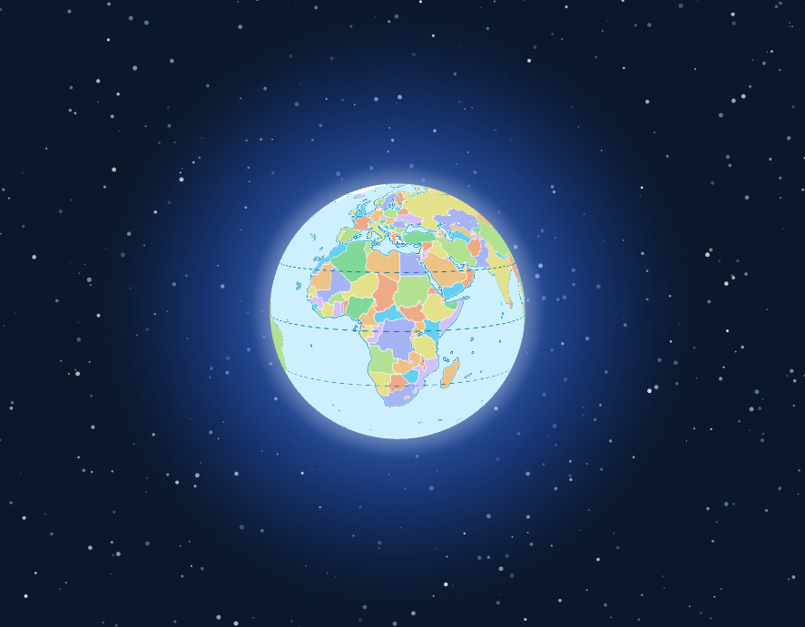

# maplibre-gl-starfield

A very simple plugin for MapLibre GL JS to add a starfield background and a subtle atmospheric glow effect around the globe in 3D globe view.



## Demo

[maplibre-gl-starfield demo](https://markmclaren.github.io/maplibre-gl-starfield)

## Usage

You can include the plugin via a `<script>` tag.

**Via Script Tag:**

Download the `maplibre-gl-starfield-0.1.js` file and include it in your HTML *after* including the MapLibre GL JS script:


1.  Ensure your MapLibre map is set to the `globe` projection.
2.  Create two empty `div` elements in your HTML to act as containers for the starfield and the globe glow. Position them behind your map container using CSS and `z-index`.
3.  Instantiate `MapLibreStarryBackground` and attach it to your map instance, providing the IDs of the starfield and glow containers.

```html
<!DOCTYPE html>
<html>
  <head>
    <meta charset="utf-8" />
    <title>MapLibre Globe with Starfield</title>
    <meta name="viewport" content="initial-scale=1,maximum-scale=1,user-scalable=no" />
    <script src="https://cdn.jsdelivr.net/npm/maplibre-gl@5.5.0/dist/maplibre-gl.js"></script>
    <link href="https://cdn.jsdelivr.net/npm/maplibre-gl@5.5.0/dist/maplibre-gl.css" rel="stylesheet" />

    <script src="maplibre-gl-starfield-0.1.js"></script>

    <style>
      body { margin: 0; padding: 0; background-color: #0A192F; }
      #map-container { position: absolute; top: 0; bottom: 0; width: 100%; z-index: 3; }
      #starfield-container { position: absolute; top: 0; left: 0; width: 100%; height: 100%; z-index: 1; pointer-events: none; }
      #globe-glow { position: absolute; top: 0; left: 0; width: 100%; height: 100%; z-index: 2; pointer-events: none; }
    </style>
  </head>
  <body>
    <div id="starfield-container"></div>
    <div id="globe-glow"></div>
    <div id="map-container"></div>

    <script>
      const map = new maplibregl.Map({
        container: "map-container",
        style: "[https://demotiles.maplibre.org/style.json](https://demotiles.maplibre.org/style.json)", // Or your preferred style
        center: [0, 0],
        zoom: 1.5,
        attributionControl: false,
        canvasContextAttributes: { antialias: true },
      });

      // Create and attach the starry background
      const starryBg = new MapLibreStarryBackground({
        starCount: 1000, // Customize number of stars
        glowIntensity: 1.0, // Customize glow intensity (0.0 to 1.0)
      });
      map.on("style.load", function () {
         map.setProjection({ type: "globe" });
         starryBg.attachToMap(map, "starfield-container", "globe-glow");
      });
    </script>
  </body>
</html>
```

## How it Works

The plugin creates two SVG layers positioned behind the MapLibre canvas:

* The **starfield** is generated using SVG circles with random positions, sizes, and opacities, giving a sense of depth. Star positions are updated based on map movement to create a parallax effect.
* The **globe glow** is rendered using SVG circles and radial gradients, positioned and sized dynamically based on the map's current zoom level and projection to simulate atmospheric scattering around the globe.

## Note on Accuracy

Please note that the starfield generated by this plugin is intended purely for aesthetic purposes to enhance the visual appearance of the globe view. The positions, sizes, and distribution of the stars are randomized and do not represent an accurate or scientifically correct star map, nor do they account for seasonal variations in the night sky.

## License

This plugin is released under the [MIT License](https://opensource.org/licenses/MIT).

This software is provided "as is", and I offer no formal support. Feel free to use, modify, and distribute it as you see fit, according to the terms of the MIT License.